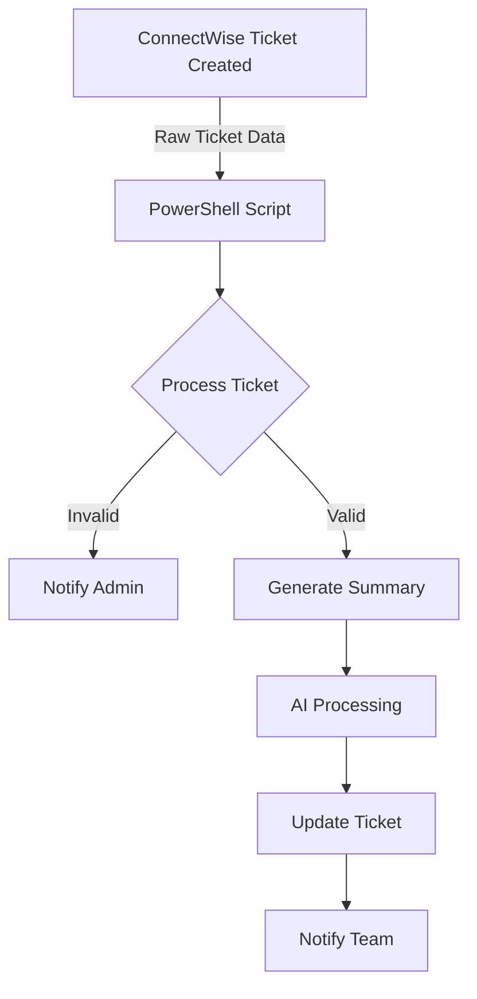

# AI Ticket Summary Automation - Technical Overview

## Workflow Summary

This automation enhances ticket management efficiency by using AI to automatically summarize ConnectWise tickets, providing clear and concise overviews for improved tracking and reporting.

## Architecture Overview

## How It Works

### 1. Data Collection

- Monitors ConnectWise tickets
- Processes ticket content including:
  - Description
  - Notes
  - Status
  - Priority
  - Time Entries

### 2. Automation Process

The workflow executes these steps automatically:

**Ticket Processing**
- Retrieves ticket content
- Extracts key information
- Prepares data for AI analysis

**AI Summary Generation**
- Analyzes ticket content
- Creates concise summary
- Identifies key action items

**ConnectWise Update**
- Updates ticket with AI summary
- Tags relevant teams
- Records automation metrics

### 3. Completion

- Updates ticket with summary
- Notifies assigned team
- Logs completion status

## Required Credentials

- ConnectWise Manage API
- Microsoft 365 Admin API

## Performance Metrics

- Average execution time: 30 seconds
- Monthly time saved: 83 hours
- Annual value: $2,070 USD

## Links

- [Source Code](https://gitlab.com/)
- [Runbook](https://example.com/user-onboarding-automation)
- [Microsoft Form Template](https://forms.microsoft.com/)

## API Keys

| Name | System | Expiration | Documentation |
|------|---------|------------|---------------|
| API_M365_Admin_Key | Microsoft 365 | 2025-11-29 | [Link](https://example.itglue.com/42/passwords/3233) |

## Schedule

Triggers on Form Submission

