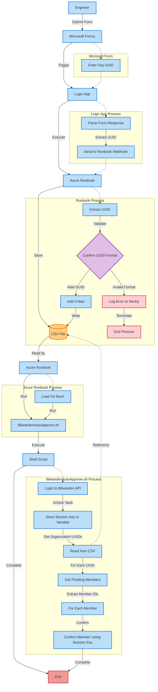

# Bitwarden Auto-Confirmation Process

## Overview
This automation automatically processes Bitwarden organizations that Ntiva resells, identifying members who have accepted invitations but are pending approval, and automatically approves them. Once approved, users still have no access to any existing vaults until explicitly granted.

You can view users pending approval by logging into Bitwarden as an administrator, accessing the **Admin Console**, selecting an organization from the drop-down, clicking **Members**, and reviewing the members under **Needs Confirmation**.

## How It Works

### Process Flow

1. Engineers submit a new Bitwarden organization UUID via Microsoft Form
2. Form submission triggers a Logic App
3. Logic App extracts the UUID and sends it to an Azure Runbook
4. Runbook stores the UUID in a CSV file if it doesn't already exist
5. A scheduled task runs a Bash script on the hybrid runbook worker
6. The script authenticates with Bitwarden, reads the CSV file, and automatically confirms pending members for each organization

### Diagram

## For Engineers: Adding New Organization UUIDs

When a new Bitwarden organization needs to be added to the auto-confirmation process, follow these steps:

1. Find the organization's UUID in the Bitwarden URL:
    - The UUID appears in the URL when viewing the organization's vault
    - Format: `https://vault.bitwarden.com/#/organizations/78a7b1cd-267d-4b32-affa-b1d5014e4c09/vault`
    - The UUID in this example is `78a7b1cd-267d-4b32-affa-b1d5014e4c09`
2. Submit the UUID using the Microsoft Form:
    - Form URL: [https://forms.office.com/r/XtdCuF5DTK](https://forms.office.com/r/XtdCuF5DTK)
    - Paste only the UUID portion, not the entire URL
3. Confirmation:
    - The form submission automatically triggers the process
    - No further action is required
    - The UUID will be added to the CSV file if it doesn't already exist
    - The auto-confirmation script will begin processing this organization during its next scheduled run

## Production Components
### Infrastructure
- **Server**: vm-hybridRW (Windows Server 2019 Datacenter)
- **Location**: North Central US
- **Subscription ID**: 140c0639-524b-4e65-a7f1-f490039f13f1
- **Resource Group**: rg-hybridRW

### Key Components
- **Microsoft Form**: https://forms.office.com/r/XtdCuF5DTK
- **Logic App**: ls-bitwardenautoconfirmation
- **Azure Runbook**: BitwardenOrganizations
- **Bash Script**: C:\Scripts\Bash\BitwardenAutoApprove.sh
- **CSV Storage**: C:\Bitwarden\Orgs.csv

### Authentication
The process uses an API key belonging to `bradley.wyatt@ntiva.com` since the Bitwarden CLI doesn't support unattended access with organization API keys. The following environment variables are configured on the Hybrid Runbook Worker:
- BW_CLIENTID
- BW_CLIENTSECRET
- BW_PASSWORD

## Troubleshooting
If the auto-confirmation process isn't working as expected:

1. **Check CSV File**:
    - Verify the UUID was added to `C:\Bitwarden\Orgs.csv` on the server
    - Ensure the UUID format is correct (example: `78a7b1cd-267d-4b32-affa-b1d5014e4c09`)
2. **Logic App Issues**:
    - Check the Logic App run history in Azure Portal
    - Verify the webhook is properly passing data to the runbook
3. **Environment Variables**:
    - Confirm the Bitwarden API credentials are properly set on the server
    - Verify the BW_PASSWORD environment variable is correctly configured
4. **Permissions**:
    - Ensure the account used for authentication has admin access to the Bitwarden organization

---
## Resources
- [Bitwarden API Documentation](https://bitwarden.com/help/api/)
- [Bitwarden CLI Documentation](https://bitwarden.com/help/cli/)
- [Managing Bitwarden Users](https://bitwarden.com/help/managing-users/#confirm)