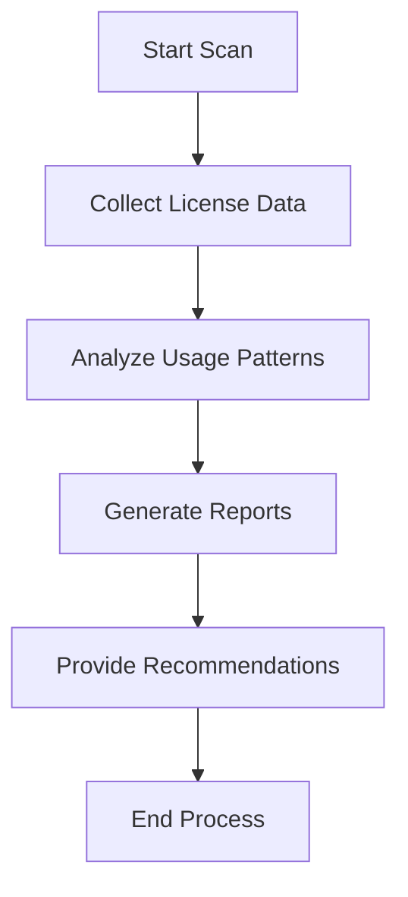

# Microsoft 365 License True-Up

## Objective
This automation is designed to help organizations manage and optimize their Microsoft 365 license usage by identifying unused or underutilized licenses. It provides insights and recommendations for license reallocation or cancellation, ensuring cost-efficiency and compliance with licensing agreements.

## Overview
The M365 License True-Up automation scans your tenant for license assignments and usage patterns, generating detailed reports to help make informed decisions about license management.

## Features
- Automated license usage analysis
- Identification of inactive users with assigned licenses
- Reports on underutilized service plans
- Cost optimization recommendations
- Compliance tracking for license agreements

## Process Flow

## Requirements
- Global Administrator or License Administrator role
- Microsoft Graph API permissions
- PowerShell 7.0 or higher
- Microsoft.Graph PowerShell module

## Usage
1. Clone this repository
2. Configure authentication settings
3. Run the main script
4. Review generated reports

## Output
The automation generates CSV reports containing:
- Users with unused licenses
- Service plan utilization metrics
- Cost savings opportunities
- Recommended actions
