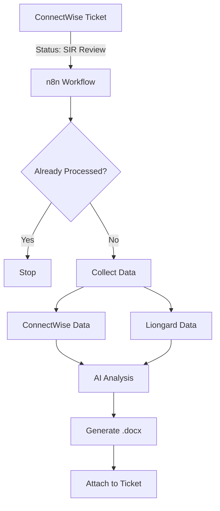
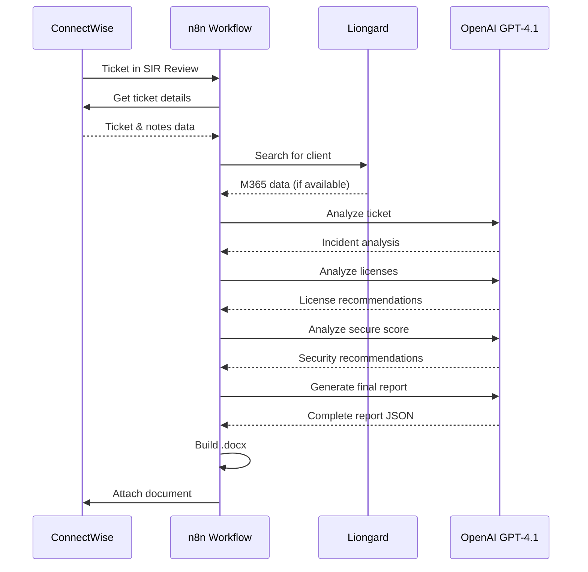

# Security Incident Report (SIR) Automation - Technical Overview

## Workflow Summary

This n8n workflow automatically generates Security Incident Reports by extracting ticket data from ConnectWise Manage, gathering security metrics from Liongard, analyzing everything with OpenAI GPT-4.1, and producing a formatted .docx report that gets attached back to the ticket.

## Architecture Overview



## How It Works

### 1. Trigger & Validation

The workflow starts when a ConnectWise ticket is saved with "SIR Review" status. Before processing:
- Checks a data table log to see if this ticket was already processed
- If already processed and not flagged for reprocessing → workflow stops
- If new ticket → creates log entry and continues

A manual form trigger allows administrators to flag tickets for reprocessing by updating the data table.

### 2. Data Collection

The workflow collects data from three sources:

**ConnectWise Manage**
- Retrieves ticket information (company, contact, priority, status, etc.)
- Fetches all ticket notes and simplifies them to key fields
- Merges the data for AI analysis

**Liongard Platform**
- Searches for the client's environment by company name
- If found, looks for an active Microsoft 365 inspector
- If M365 inspector exists, retrieves:
  - License summary (consumed units, SKUs, utilization rates)
  - Microsoft Secure Score (current score, controls needing work)
- If environment or inspector not found → sends empty data to avoid workflow failure

### 3. AI Analysis



Three AI analysis steps using OpenAI GPT-4.1:

**Ticket Analysis**
- Extracts incident details (type, dates, affected parties, root cause)
- Identifies security controls from technician notes
- Builds chronological timeline from ticket notes
- Outputs structured JSON with incident and security analysis

**License Analysis** (if Liongard data available)
- Reviews current Microsoft 365 licenses
- Identifies security-relevant licensing gaps
- Recommends license upgrades for security enhancement

**Secure Score Analysis** (if Liongard data available)
- Analyzes current score vs. industry benchmarks
- Generates top 15 security recommendations
- Formats as table with Priority, Category, Recommendation, Impact

### 4. Report Generation

**Final AI Synthesis**
- Combines all previous analysis results
- Generates executive-ready language and recommendations
- Produces comprehensive JSON with all report fields populated

**XML Construction**
- JavaScript code builds Word-compatible XML
- Fills template placeholders with AI-generated data
- Creates dynamic timeline table with multiple rows
- Generates Secure Score recommendations table

**Document Creation**
- Reads the stored .docx template file
- Extracts the ZIP structure (docx files are zipped XML)
- Replaces the word/document.xml file with generated XML
- Rebuilds the ZIP with proper CRC32 checksums
- Outputs completed .docx file

### 5. Delivery

- Uploads the generated .docx to ConnectWise Manage
- Attaches it to the original ticket
- Filename format: `[ticketId]_SIR_[clientName]_Draft.docx`

## Key Technical Details

### AI Configuration
- Model: GPT-4.1
- Temperature: 0.2 (low for consistency)

### Document Generation
The .docx creation uses a custom ZIP manipulation approach because Word documents are ZIP archives containing XML files. The workflow:
1. Reads the template as binary buffer
2. Extracts all files from the ZIP
3. Replaces word/document.xml with generated content
4. Recalculates CRC32 checksums for ZIP integrity
5. Rebuilds the complete ZIP structure

### Error Handling
The workflow uses "graceful degradation":
- If Liongard environment not found → continues with empty licensing/score data
- If M365 inspector not found → continues with empty licensing/score data
- AI analyses adapt prompts based on available data
- Report generation succeeds even with partial information

### Security Controls Detection
The AI specifically looks for technician-provided security control information in ticket notes. Technicians should label controls like:
```
Security Controls:
- Antivirus/EDR: CrowdStrike Falcon
- Email Security: Proofpoint
- MDR/SOC: Blackpoint Cyber
- SIEM: Ntiva SIEM
- Security Training: KnowBe4
- MFA: Microsoft Authenticator
```

If not explicitly provided, the report will show "PLEASE UPDATE" for manual completion.

## Credentials Required

- **ConnectWise Manage**: HTTP Basic Auth with API key (Natalie credentials)
- **Liongard**: HTTP Header Auth for US5 instance
- **OpenAI**: API key for GPT-4.1 access

## Performance

- **Execution Time**: 2-3 minutes per ticket
- **Manual Time Saved**: ~120 minutes per SIR

## Limitations

- Requires technicians to document security controls in structured format
- Liongard data only available for clients with M365 inspector configured
- Report quality depends on detail level in ticket notes
- Manual review still recommended before client delivery