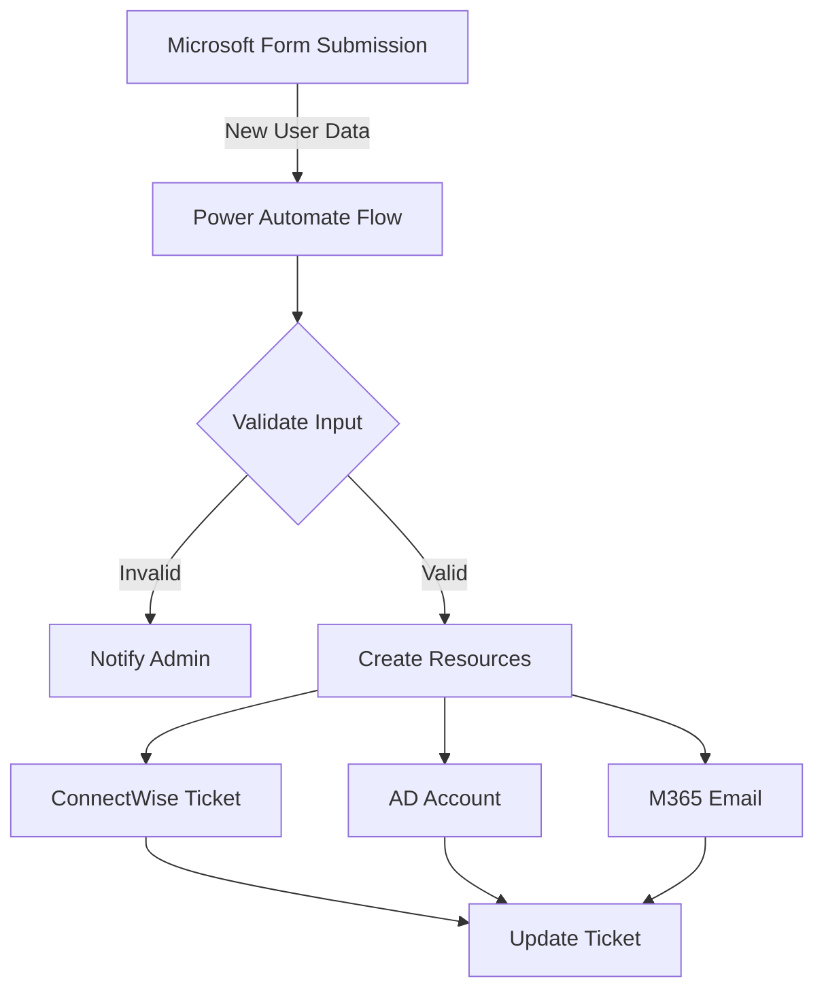

# User Onboarding Automation - Technical Overview

## Workflow Summary

This automation streamlines the user onboarding process by using Microsoft Forms to collect new user information, then automatically creates tickets in ConnectWise Manage, sets up Active Directory accounts, and provisions Microsoft 365 email accounts.

## Architecture Overview

## How It Works

### 1. Data Collection

- Microsoft Form collects new user information
- Required fields include:
  - Full Name
  - Department
  - Manager
  - Start Date
  - Required Systems

### 2. Automation Process

The workflow executes these steps automatically:

**ConnectWise Manage**
- Creates onboarding ticket
- Assigns to IT team
- Tracks progress through completion

**Active Directory**
- Creates user account
- Sets security groups
- Configures permissions

**Microsoft 365**
- Provisions email account
- Assigns licenses
- Sets up mailbox rules

### 3. Completion

- Updates ticket with completion status
- Notifies manager and IT team
- Documents all actions taken

## Required Credentials

- Microsoft 365 Admin API
- ConnectWise Manage API
- Domain Admin Account

## Performance Metrics

- Average execution time: 5-7 minutes
- Monthly time saved: 83 hours
- Annual value: $22,070 USD

## Links

- [Source Code](https://gitlab.com/)
- [Runbook](https://example.com/user-onboarding-automation)
- [Microsoft Form Template](https://forms.microsoft.com/)

## API Keys

| Name | System | Expiration | Documentation |
|------|---------|------------|---------------|
| API_M365_Admin_Key | Microsoft 365 | 2025-10-29 | [Link](https://example.itglue.com/42/passwords/3233) |
| OpenAI_Natalie-SOC_API_Key | Open AI | 2025-10-29 | [Link](https://ntiva.itglue.com/4259244/passwords/32955145) |

## Schedule

Triggers on Microsoft Form submission
